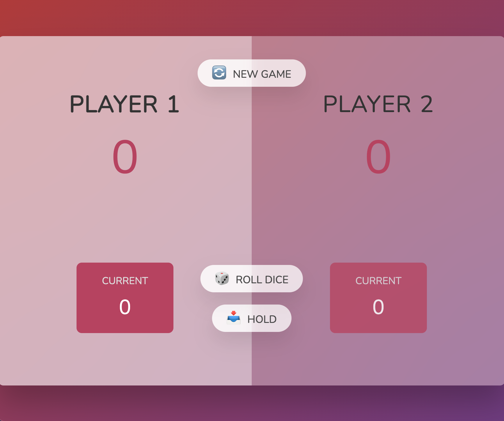

# Dice_Game_JS
This was a fun project that I followed from a Udemy tutorial series. There are minor tweaks to the JavaScript and CSS codes, but overall, it is a rather faithful following from the tutorial. The point of the game is that players alternate turns rolling the dice. Whoever reaches a compound score of 50 or above wins. However, if someone rolls a '1' on the dice, they lose all their points. Therefore, players can 'hold' their score and pass to the next player if they wish to hold their score thus far.

## JavaScript Techniques
This project greatly illustrates many DOM concepts such as `document.querySelector()`, `document.GetElementByID()`, `toggle()`, `classList.add()` among others. It also teaches one a lot about buttons since there are three in this game: one to start a new game, one to roll the dice, and one to hold the score.

## Game Look
The game CSS was provided by Jonas, the course creator. The game looks pretty good! Do note that once a player wins, the screen turns darker, and when it is a player's turn, the player's side turns lighter.

